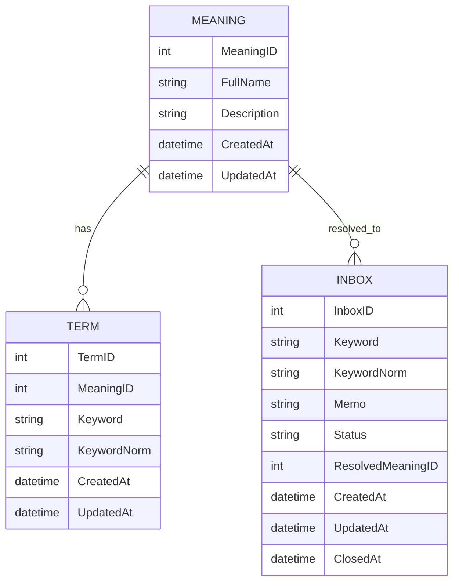
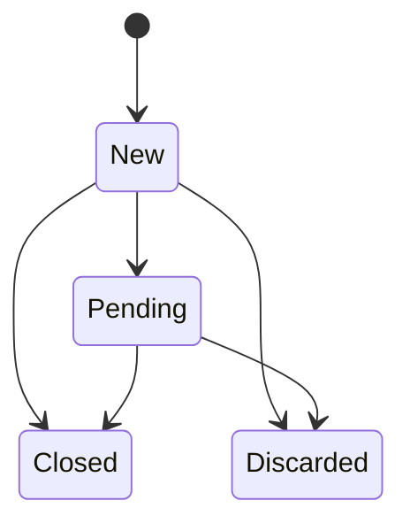

# ドメインモデル

## 概念

TermKeeperは以下の流れで情報を管理する。

```text
INBOX
↓
TERM
↓
MEANING
```

## ER図



## TERM

検索に利用する単語。

例:

```text
MDM
Master Data Management
マスタ管理
```

## MEANING

利用者が理解したい対象。

例:

```text
Master Data Management

顧客・商品・取引先などの
マスタデータを統合管理する仕組み
```

## INBOX

未整理用語の保管場所。

会議中はまずここへ登録する。

## 状態遷移


