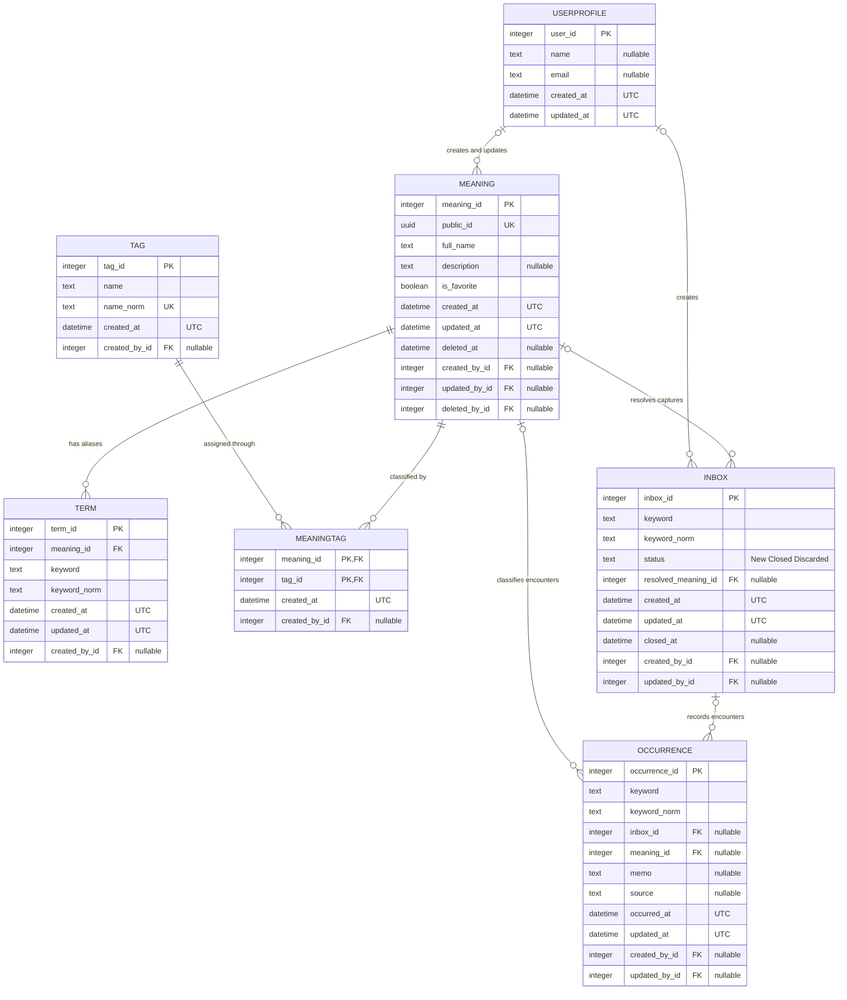
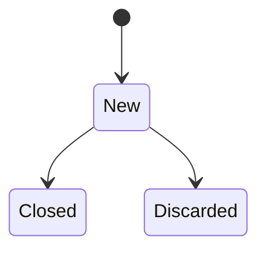

# ドメインモデル

## 概念

TermKeeperは、遭遇をOccurrenceとして記録し、未整理のInboxをMeaningへ解決する。

```text
USERPROFILE ──> INBOX ──> OCCURRENCE
                    └── resolves to ──> MEANING <── TERM
```

## ER図



### リレーションと制約

- 1つのMeaningは0個以上のTermを持つ。
- Termは必ず1つのMeaningに属し、Meaning削除時に連動して削除される。
- Inboxは未解決・破棄状態ではMeaningを持たず、解決後に1つのMeaningを参照する。
- 用語への遭遇は毎回Occurrenceとして保存し、sourceやmemoを上書きしない。
- Occurrenceの `keyword_norm` は履歴検索に使用する。
- Inbox・Occurrence編集時は`updated_at`と`updated_by_id`を記録する。
- Meaningは外部連携用の安定したUUID `public_id` を持つ。
- Meaningの`is_favorite`は重要な用語の一覧・検索フィルターに使用する。
- Meaning削除は`deleted_at`と`deleted_by_id`による論理削除とし、Term・Tag・履歴を保持する。
- 開いているInboxの `keyword_norm` は部分一意制約で重複を防ぐ。
- Termの `(keyword_norm, meaning_id)` は一意で、同じMeaningへの別表記の重複を防ぐ。
- Tagの `name_norm` は一意で、MeaningTagによりMeaningと多対多で関連付ける。
- `keyword_norm` はNFKC正規化と大文字・小文字の統一後の検索値を保持する。

### インデックス

| インデックス | 対象列 | 用途 |
| --- | --- | --- |
| `uq_inbox_open_keyword` | `inbox.keyword_norm WHERE status = NEW` | 未解決Inboxの重複防止 |
| `idx_term_keyword` | `term.keyword_norm` | 用語検索 |
| `idx_term_meaning` | `term.meaning_id` | Meaningから別名を取得 |
| `ix_occurrence_keyword_norm` | `occurrence.keyword_norm` | 遭遇用語の検索 |
| `ix_occurrence_occurred_at` | `occurrence.occurred_at` | 期間検索と新しい順の表示 |
| `ix_tag_name_norm` | `tag.name_norm` | タグの正規化検索 |
| `ix_meaning_deleted_at` | `meaning.deleted_at` | 通常データとTrashの分離 |
| `ix_meaning_is_favorite` | `meaning.is_favorite` | お気に入りの絞り込み |

## TERM

検索に利用する単語。

例:

```text
MDM
Master Data Management
マスタ管理
```

## MEANING

利用者が理解したい対象。

例:

```text
Master Data Management

顧客・商品・取引先などの
マスタデータを統合管理する仕組み
```

## INBOX

未整理用語の保管場所。

会議中はまずここへ登録する。

## 状態遷移


