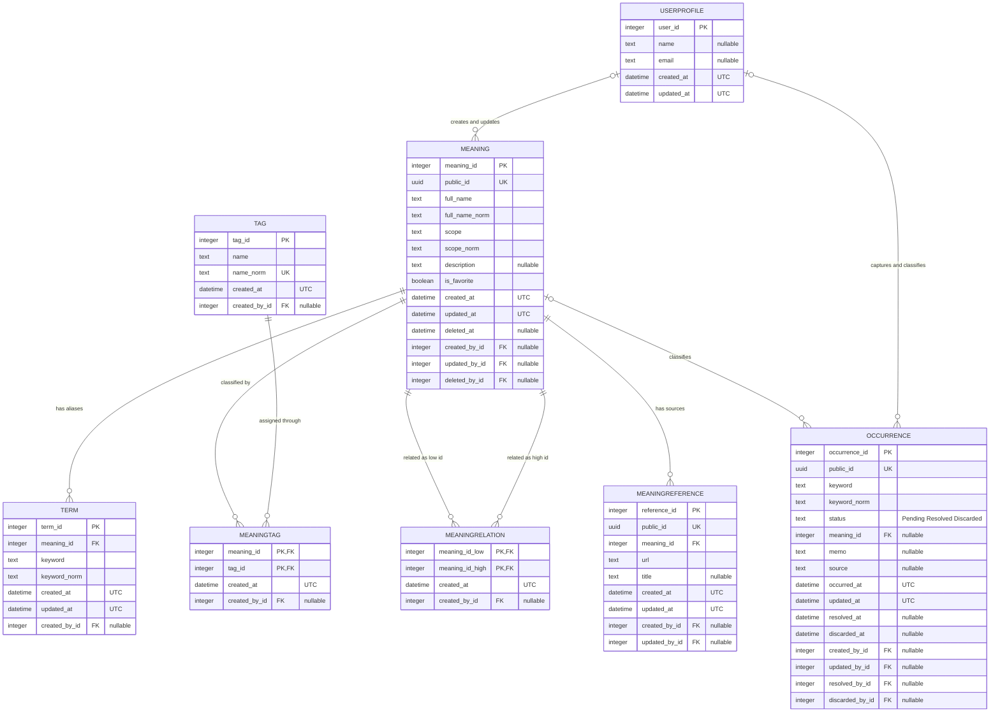
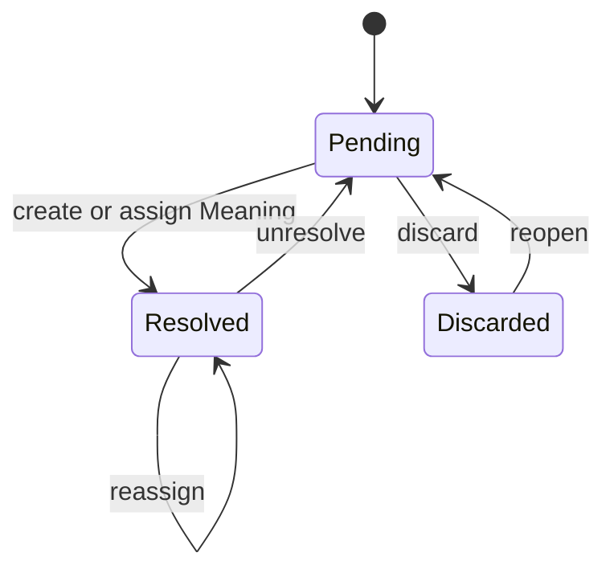

# ドメインモデル

## 概念

TermKeeperは遭遇をOccurrenceとして保存し、Meaningへの分類を別操作として扱う。

```text
Occurrence(Pending) ── explicit classification ──> Meaning <── Term
```

文字列の一致は分類候補を生成するだけで、分類の根拠にはしない。Inboxは`Pending`の
Occurrence一覧であり、DBテーブルではない。

## ER図



## 状態遷移



DBのCHECK制約は次を保証する。

- `Pending`: `meaning_id IS NULL`
- `Resolved`: `meaning_id IS NOT NULL`
- `Discarded`: `meaning_id IS NULL`

## Meaningとscope

Meaningは文字列ではなく概念を表す。`scope`はSAP、Oracle、Radio、Generalなど、概念が成立する
製品・組織・業務領域を表す。

```text
ERP [SAP]   → Enterprise Resource Planning
ERP [Radio] → Effective Radiated Power
```

有効Meaningの`(scope_norm, full_name_norm)`は一意。同じ正式名称でもscopeが異なれば別概念として
登録できる。Termの`keyword_norm`はMeaningをまたいで一意にしないため、同じ略語を複数概念が
持てる。

## リレーションと制約

- 遭遇は毎回独立したOccurrenceとして保存する。
- Occurrenceのkeyword、memo、sourceは遭遇時点の履歴であり、Meaning編集で変更しない。
- Term一致は候補検索にだけ使用し、Meaningへ自動分類しない。
- Termの`(keyword_norm, meaning_id)`は一意。
- Meaningの論理削除後もOccurrenceの分類参照は保持する。
- 参照中Meaningの物理削除は`RESTRICT`し、分類履歴を暗黙に失わない。
- MeaningRelationは小さいMeaning IDを先にした対称ペア。
- MeaningReferenceの`(meaning_id, url)`は一意。
- `keyword_norm`、`scope_norm`、`full_name_norm`はNFKCとcasefold相当の正規化検索値。
- 外部境界ではMeaning、Occurrence、MeaningReferenceのUUID `public_id`を使用する。

## インデックス

| インデックス | 対象 | 用途 |
| --- | --- | --- |
| `uq_meaning_active_scope_name` | `scope_norm, full_name_norm WHERE deleted_at IS NULL` | scope内の重複Meaning防止 |
| `idx_term_keyword` | `term.keyword_norm` | 候補・用語検索 |
| `idx_term_meaning` | `term.meaning_id` | Meaningの別名取得 |
| `ix_occurrence_keyword_norm` | `occurrence.keyword_norm` | 遭遇語検索 |
| `ix_occurrence_status` | `occurrence.status` | Inboxと状態絞り込み |
| `ix_occurrence_occurred_at` | `occurrence.occurred_at` | 期間・新しい順 |
| `ix_meaning_deleted_at` | `meaning.deleted_at` | 通常一覧とTrashの分離 |
| `ix_meaning_is_favorite` | `meaning.is_favorite` | お気に入り絞り込み |
| `ix_occurrence_public_id` | `occurrence.public_id` | 外部UUID解決 |
| `ix_meaningreference_public_id` | `meaningreference.public_id` | 外部UUID解決 |
