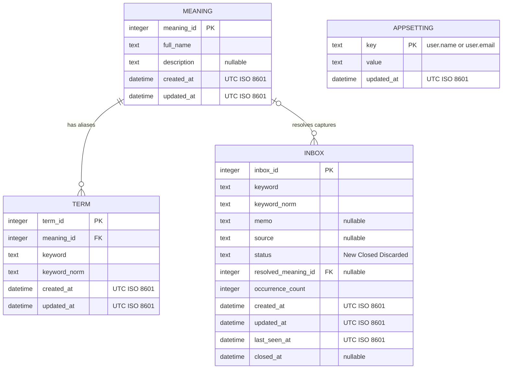
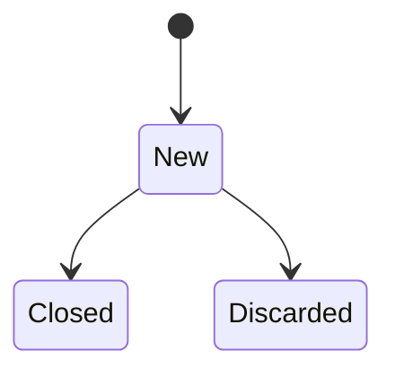

# ドメインモデル

## 概念

TermKeeperは、捕捉したInboxをMeaningへ解決し、Meaningに複数の検索語Termを関連付ける。

```text
INBOX ── resolves to ──> MEANING <── belongs to ── TERM
```

## ER図



### リレーションと制約

- 1つのMeaningは0個以上のTermを持つ。
- Termは必ず1つのMeaningに属し、Meaning削除時に連動して削除される。
- Inboxは未解決・破棄状態ではMeaningを持たず、解決後に1つのMeaningを参照する。
- Termの `(keyword_norm, meaning_id)` は一意で、同じMeaningへの別表記の重複を防ぐ。
- `keyword_norm` はNFKC正規化と大文字・小文字の統一後の検索値を保持する。

### インデックス

| インデックス | 対象列 | 用途 |
| --- | --- | --- |
| `idx_inbox_open_keyword` | `inbox.keyword_norm, status` | 未解決Inboxの重複確認 |
| `idx_term_keyword` | `term.keyword_norm` | 用語検索 |
| `idx_term_meaning` | `term.meaning_id` | Meaningから別名を取得 |

## TERM

検索に利用する単語。

例:

```text
MDM
Master Data Management
マスタ管理
```

## MEANING

利用者が理解したい対象。

例:

```text
Master Data Management

顧客・商品・取引先などの
マスタデータを統合管理する仕組み
```

## INBOX

未整理用語の保管場所。

会議中はまずここへ登録する。

## 状態遷移


